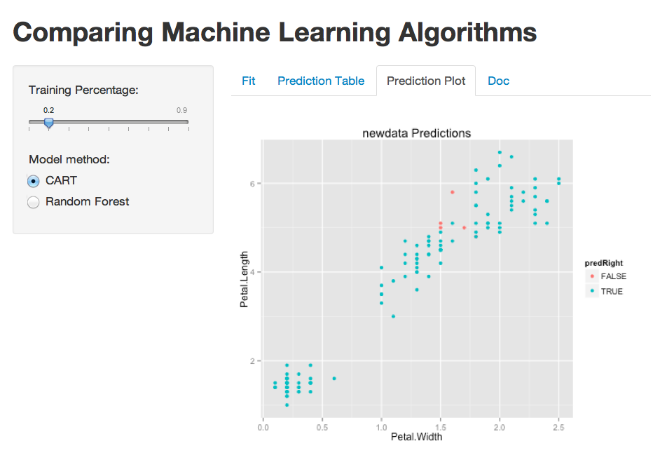
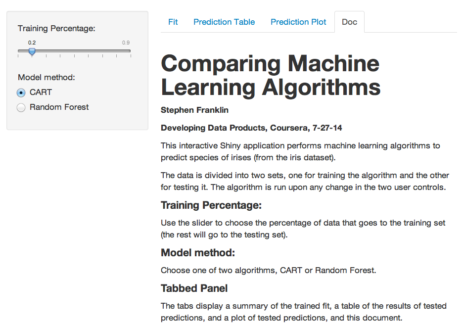

### Comparing Machine Learning Algorithms   

[This interactive Shiny application](http://stephenfranklin.shinyapps.io/datprod_shiny/) compares two machine learning algorithms to predict species of irises (from the iris dataset).
The data is divided into two sets, one for training the algorithm and the other for testing it. The algorithm is run reactively upon any change in the two user controls.



---

### Code excerpt from ui.R
This code shows how to implement user interactivity.

```r
sidebarPanel(
            sliderInput("train_percent",
                        "Training Percentage:",
                        min = 0.10, max = 0.90, 
                        value = 0.20, step = 0.10),
            br(),
            radioButtons("method", "Model method:",
                         c("CART" = "rpart",
                           "Random Forest" = "rf")
            )
)
```

---

### Code excerpt from server.R
The code snippet run here shows the prediction table of species  of irises. An classification tree (`rpart`) was trained (using `caret`) on the iris dataset and the test data was then predicted.

```r
    ### A reactive expression executes when the inputs change.
    outs <- reactive({interact(input$train_percent, input$method)})
    output$table.out <- renderTable({outs()$out.table})
```

```{r, echo=FALSE, message=FALSE}
library(caret); library(rpart)
data(iris)
train_percent<-0.30
method<-"rpart"

## Create Iris Training And Test Sets with given train percentage
partitionData <- function(train_percent){
    data(iris)
    set.seed(42)
    inTrain <- createDataPartition(y=iris$Species, p=train_percent, list=FALSE)
    training <- iris[inTrain,]
    testing <- iris[-inTrain,]
    #dim(training); dim(testing)
    invisible( list(training=training, testing=testing) )
}

## Partition, Train, Output tables and plots
interact <- function(train_percent, method){
    data <- partitionData(train_percent) ## list of training, testing.
    ## Train Model Fit
    set.seed(42)
    fit <- train(Species ~ ., method=method, data=data$training)
    set.seed(42)
    pred <- predict(fit,newdata=data$testing)
    predRight <- pred==data$testing$Species
    
    ## Output
    out.table <- table(pred,data$testing$Species)
    out.table=out.table
}

    ### A reactive expression executes when the inputs change.
    outs <- interact(train_percent, method)
    outs
```

The `interact()` function actually calls several other functions which ultimately output the table above.
(The entire code won't fit on this slide, but it was processed by Rstudio when the slidify document was knitted!)

Here's the [complete code](https://github.com/stephenfranklin/datprod_shiny). 

---

### Documentation and Expansion

More machine learning algorithms, more graphical outputs (such as tree diagrams and class centers), and even more datasets can be easily added!



http://stephenfranklin.shinyapps.io/datprod_shiny/
